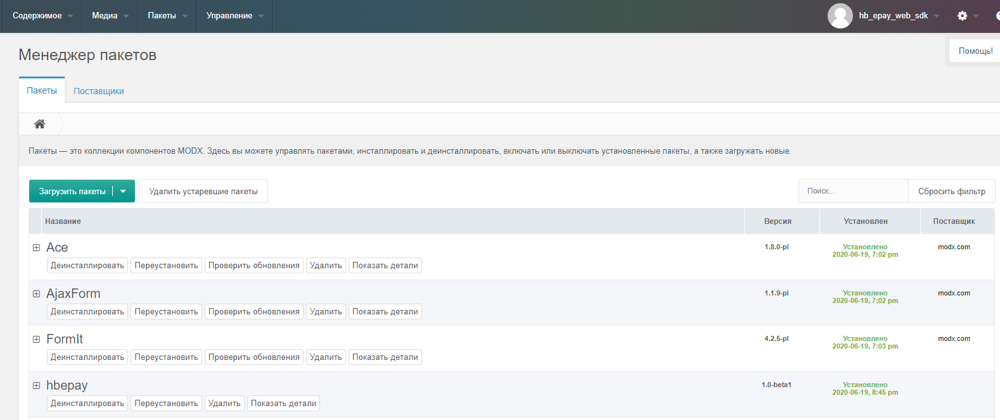
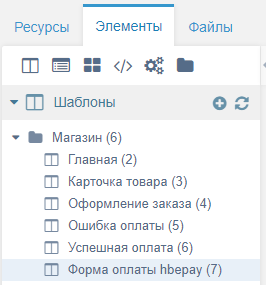
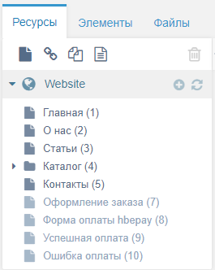
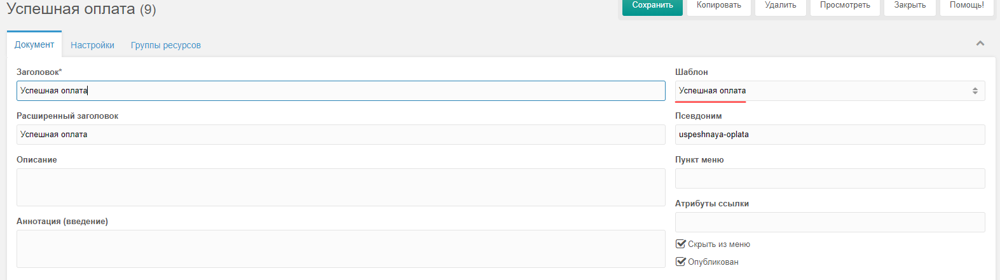
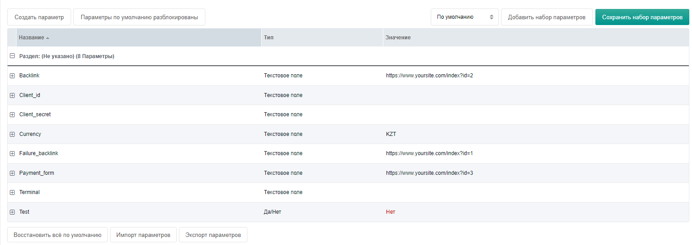
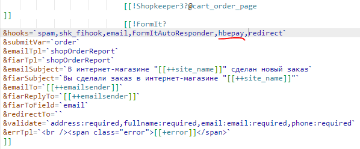
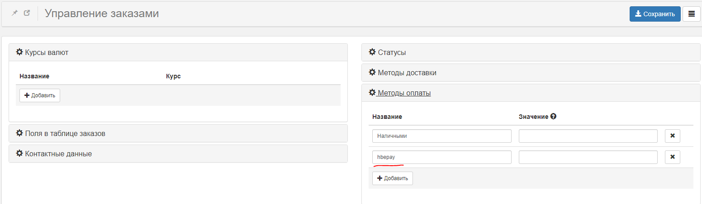

# modx-2.7x-plugin
Плагин оплаты в cms ModX: включает возможность передачи товарной корзины

## Версия
Плагин разрабатывался на версии **2.7.3**

## Установка плагина
### 1. Для установки платежного модуля hbepay необходимо произвести следующие действия: 
Скачайте архив модуля и распакуйте его. Загрузите архив hbepay: “Пакеты” – “Установщик” – “Загрузить плагины” – “Загрузить пакет с компьютера”. В таблице пакетов появится пакет "hbepay". Нажмите кнопку “Установить”. Завершите установку.



### 2. Необходимо создать 3 страницы:
Страница оплаты через hbepay. Вставить в поле "Содержимое ресурса" вызов сниппета:
```   
[[!hbepay? action=`payment`]]
```
страница с сообщением об успешной оплате (с любым содержанием). Вставить в поле "Содержимое ресурса" вызов сниппета:
```
[[!hbepay? action=`success`]]
```
страница с сообщением об отмене оплаты. Вставить в поле "Содержимое ресурса" вызов сниппета:
```
[[!hbepay? action=`fail`]]
```


Для каждой страницы создаем документы во вкладке “Ресурсы”:



Для каждого документа указываем соответствующий шаблон


### 3. Измените параметры сниппета hbepay:
Импортируем файл со списком параметров: Добавить набор параметров – выбираем config.js, который поставляется вместе с плагином. (snippets->hbepay->параметры->параметры по умолчанию разблокированы->импорт->импортировать config.js)


Test – 0. Если прописать 1, включается тестовый режим и денежные средства со счета не снимаются.

Backlink - `http://имя_вашего_сайта/index.php?id=ID`

ID_ документа страницы - страница с сообщением об успешной оплате (узнать id:меню справа->ресурсы->Успешная оплата (ВАШ ID)

Failure_backlink- `http://имя_вашего_сайта/index.php?id=ID`

ID_ документа страницы - (узнать id:меню справа->ресурсы-> Ошибка оплаты (ВАШ ID)

Payment_form- `http://имя_вашего_сайта/index.php?id=ID`

ID_ документа страницы - страница с формой оплаты hbepay, (узнать id:меню справа->ресурсы->Форма оплаты hbepay (ВАШ ID)

При выборе тестовой версии, вы можете ввести [следующие данные:](https://epayment.kz/docs/platezhnaya-stranica)
- ID клиента: `test`
- Секретный ключ: `yF587AV9Ms94qN2QShFzVR3vFnWkhjbAK3sG`
- Терминал: `67e34d63-102f-4bd1-898e-370781d0074d`

### 4. На странице формы оформления заказа в вызове сниппета FormIt в список используемых хуков необходимо добавить hbepay перед redirect. В методе оплаты добавить hbepay. 
Теперь после отправки заказа на следующей странице будет появляться кнопка "Оплатить сейчас".


